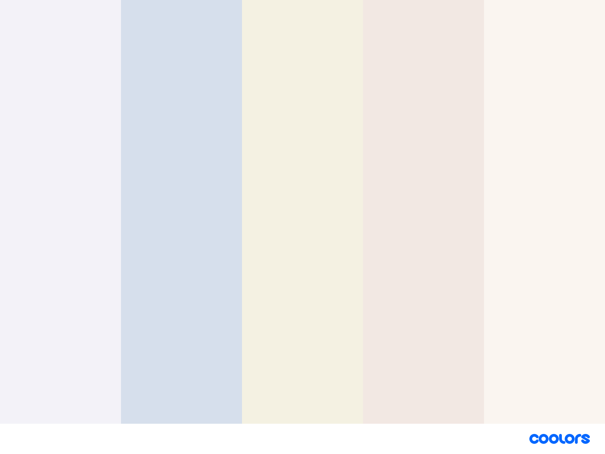
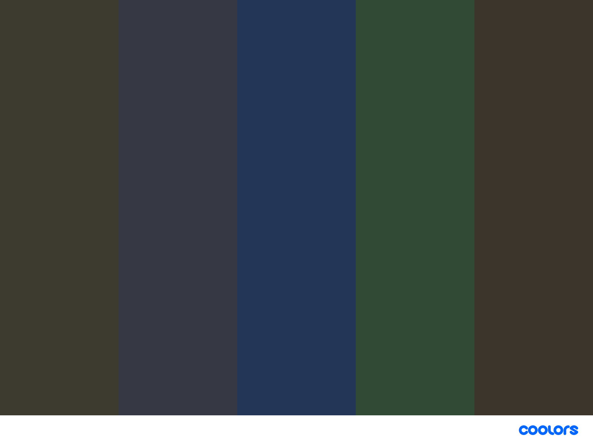

# To Do

Send all text and image content to <knnthrmllr@gmail.com>.

Set up new Gmail for WLUA and provide login credentials.  I will use this information to make a public events calendar that you can edit and update at anytime.  **I will not save this information** and I encourage you to change the password at the conclusion of the project.

Purchase domain name of your choice and provide login credentials.  I will use this information to deploy the site.  **Again, I will not save this information** and I encourage you to change the password at the conclusion of the project.

Decision on site handoff/maintenance.  Your choice will affect the final build process.

# Sample Fonts

Note: This paragraph loads faster than the font samples below. According to a study done by Google, the typical user expects the content of a website to load within two seconds. On average, 57% of users will leave a site if content has not loaded in three seconds. The current build is requesting fonts from Google. Your selection will be hosted locally upon final build and this delay will no longer occur. Feel free to look at the [Google font library](https://fonts.google.com/?vfonly=true&preview.text=Washington+Lacrosse+Umpires+Association&preview.text_type=custom) for alternatives.

<h2 id='mulish'>Mulish</h2>

Welcome to the Washington Lacrosse Umpires Association (WLUA) website. We hope to connect with all of our members to share news and updates.

<h2 id='ruda'>Ruda</h2>

Welcome to the Washington Lacrosse Umpires Association (WLUA) website. We hope to connect with all of our members to share news and updates.

<h2 id='sig'>Signika</h2>

Welcome to the Washington Lacrosse Umpires Association (WLUA) website. We hope to connect with all of our members to share news and updates.

# Color Swatches

Feel free to visit [Coolors](https://coolors.co/) and provide me with colors that you like for your background and text.  I will come back with options and we can tailor to your preference..

## Background

## Accent/Text

